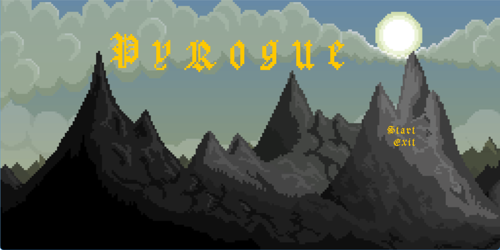
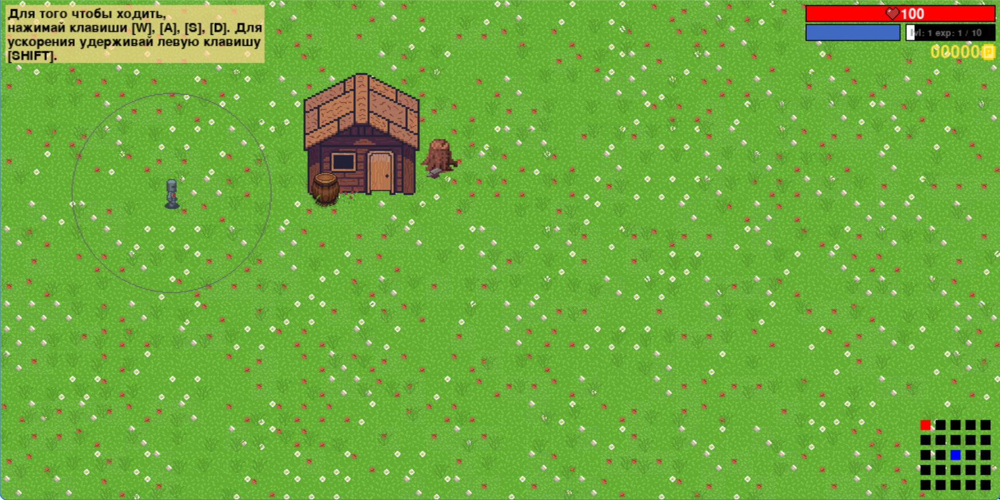
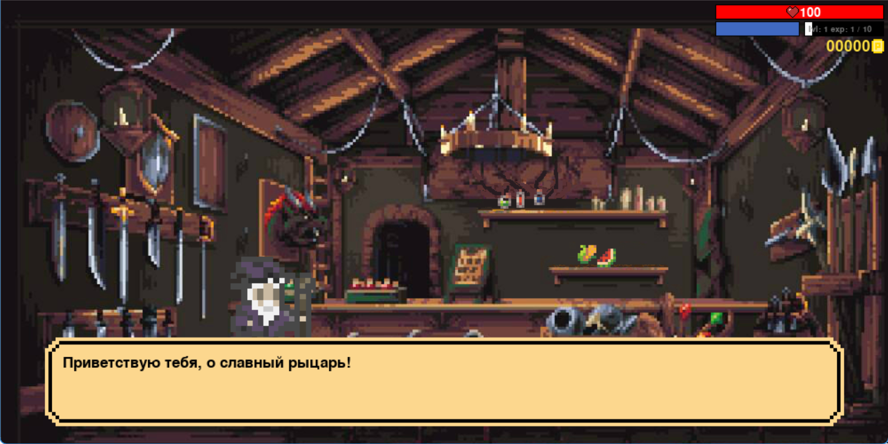
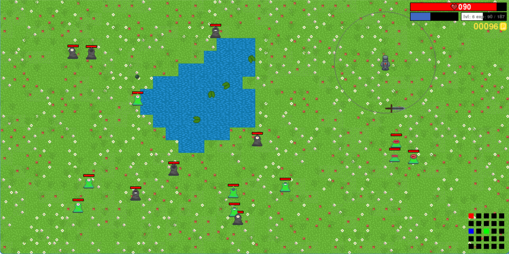
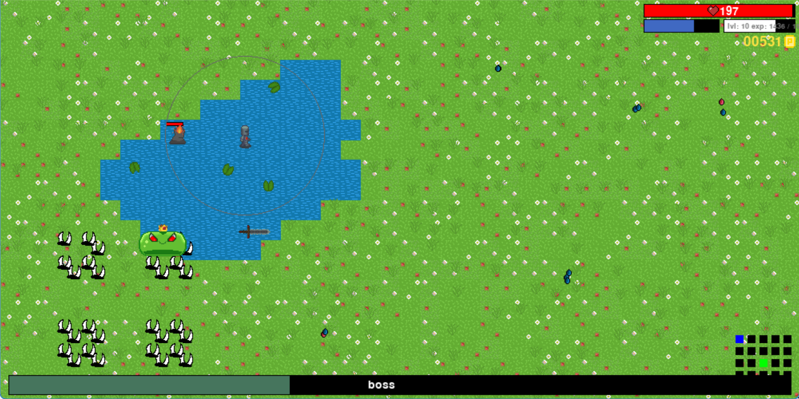

# PyRogue 2.0

<div align="center">
  
</div>

## Описание

PyRogue 2.0 - это захватывающая игра в жанре rogue-like, разработанная на Python с использованием библиотеки Pygame. В игре вы управляете героем, исследуете мир, сражаетесь с врагами, торгуете с NPC и развиваете своего персонажа.

## Особенности

- 🎮 Процедурная генерация мира с различными типами местности
- ⚔️ Динамическая боевая система
- 💰 Система торговли с NPC
- 🎯 Система опыта и уровней
- 🎵 Звуковые эффекты и музыка
- 🎨 Красивая пиксельная графика
- 🧪 Система зелий и предметов
- 🐉 Боссы и особые враги
- 💪 Система выносливости и здоровья

## Галерея







## Установка

1. Убедитесь, что у вас установлен Python 3.7 или выше
2. Клонируйте репозиторий:
```bash
git clone https://github.com/Ju5tNick/PyRogue-2.0.git
cd PyRogue-2.0
```

3. Установите зависимости:
```bash
pip install -r requirements.txt
```

## Запуск

```bash
python main.py
```

## Управление

- WASD - перемещение
- Shift - ускорение
- Движение мышкой - атака
- E - взаимодействие с торговцем

## Системные требования

- Python 3.7+
- Pygame 2.1.2
- 2GB RAM
- Любая ОС с поддержкой Python

## Структура проекта

```
PyRogue-2.0/
├── assets/           # Игровые ресурсы
├── classes/          # Основные классы игры
├── helpers/          # Вспомогательные функции
├── main.py           # Точка входа в игру
└── requirements.txt  # Зависимости проекта
```

---

⭐ Не забудьте поставить звезду репозиторию, если вам понравился проект!
